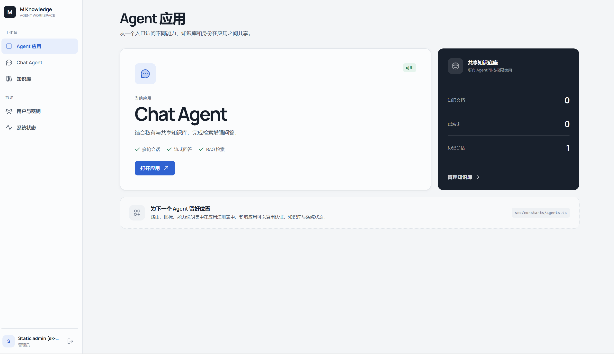
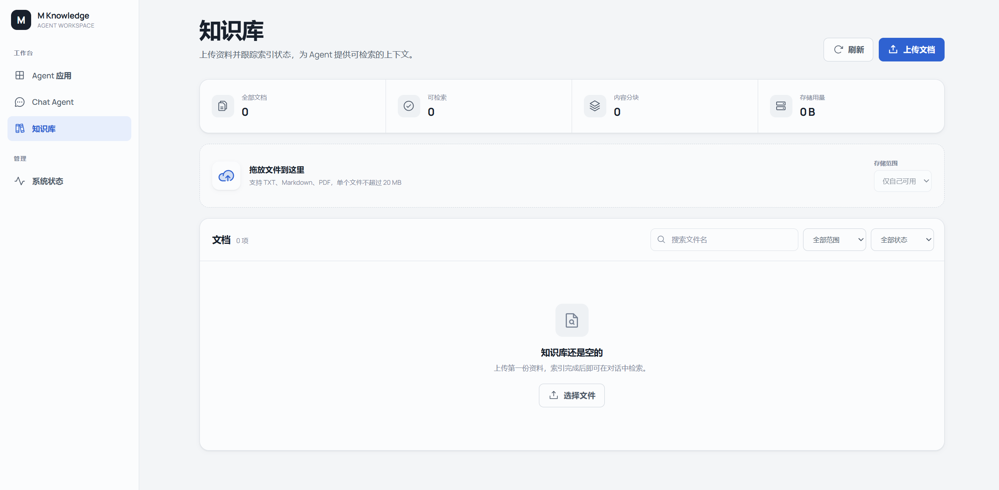

# m-agent-workbench

面向多 Agent 应用的统一工作台。

`m-agent-workbench` 基于 FastAPI 与 Vue 3 构建，为 Agent 应用提供统一入口，并集中管理身份认证、成员权限、会话、知识库和运行状态。当前内置 Chat Agent 与 RAG 知识库，后续 Agent 可以复用同一套工作台基础能力持续接入。

## 核心能力

- **Agent 应用中心**：从统一入口访问不同 Agent，当前提供 Chat Agent。
- **流式智能对话**：支持 SSE 流式回答、多轮会话和会话历史。
- **RAG 知识库**：支持文档解析、向量索引，以及私有、共享、混合范围检索。
- **成员与密钥管理**：使用数据库持久化用户和 API Key，并按管理员、成员角色控制权限。
- **可扩展工作台**：前端通过 Agent 注册表展示应用，后端提供 Agent 基类、工具注册与服务层，便于继续接入新 Agent。
- **运行状态监控**：统一查看 Agent、Embedding、Milvus 与检索服务状态。

## 界面预览







---

## 项目结构

```
m-agent-workbench/
├── src/
│   ├── agents/                    # Agent 层：BaseAgent / ChatAgent
│   ├── tools/                     # Agent 工具基类与注册表
│   ├── models/                    # LLM 适配
│   ├── config/                    # Agent 全局配置
│   └── server/                    # FastAPI 工作台后端
│       ├── main.py                # 应用初始化与生命周期
│       ├── api/                   # 认证、用户、会话与 Chat Agent API
│       ├── documents/             # 知识库文档管理
│       ├── repositories/          # SQLite / Memory 存储实现
│       ├── services/              # 认证、会话、对话与检索编排
│       ├── embedding/             # Embedding 服务适配
│       ├── milvus/                # Milvus 向量数据库
│       ├── tasks/                 # 文档索引任务管线
│       ├── parsing/               # Text / Markdown / PDF / MinerU 解析
│       ├── chunking/              # 文档分块策略
│       └── storage/               # OSS / Local 文件存储
│
├── front/                         # Vue 3 前端
│   ├── src/constants/agents.ts    # Agent 应用注册表
│   ├── src/views/                 # 应用中心、对话、知识库、管理与系统页面
│   ├── src/components/            # 布局、对话与反馈组件
│   ├── src/stores/app.ts          # Pinia 全局状态
│   ├── src/api/client.ts          # 后端 API 客户端
│   └── src/styles/main.css        # 工作台视觉样式
│
├── webui/index.html               # 单文件测试控制台 (纯 HTML/JS)
├── .env.example                   # 环境变量模板
└── requirements.txt               # Python 依赖
```

---

## 快速开始

### 1. 安装依赖

```bash
pip install -r requirements.txt
```

### 2. 配置环境变量

```bash
cp .env.example .env
```

最少配置:
```bash
# LLM (至少一个)
DEEPSEEK_API_KEY=sk-your-key

# Embedding (可选, 无则不建索引)
BAILIAN_API_KEY=sk-your-key

# Milvus (可选, 无则不建索引)
MILVUS_HOST=localhost
```

### 3. 初始化首位管理员（仅全新数据库）

API Key 不再从 `.env` 加载，而是创建后仅以哈希形式持久化。已有数据库可跳过此步：

```bash
python -m src.server.bootstrap_admin --name Administrator
```

命令只会显示一次完整 API Key，请立即妥善保存。

### 4. 启动后端

```bash
uvicorn src.server.main:app --reload --port 8000
```

### 5. 启动前端

```bash
cd front
npm install
npm run dev        # http://localhost:5173
```

或使用测试控制台:
```bash
# 浏览器打开 webui/index.html
```

---

## 工作台 API

### 认证 & 用户

| 方法 | 端点 | 权限 | 说明 |
|------|------|------|------|
| `GET` | `/api/v1/me` | 用户 | 当前用户信息 |
| `GET` | `/api/v1/users` | admin | 用户列表 |
| `POST` | `/api/v1/users` | admin | 创建用户 |
| `GET` | `/api/v1/users/{id}` | admin | 用户详情 |
| `DELETE` | `/api/v1/users/{id}` | admin | 删除用户 |
| `GET` | `/api/v1/users/{id}/api-keys` | admin | 用户所有 Key |
| `POST` | `/api/v1/api-keys` | admin | 生成 Key |
| `DELETE` | `/api/v1/api-keys/{prefix}` | admin | 撤销 Key |

### 会话

| 方法 | 端点 | 说明 |
|------|------|------|
| `GET` | `/api/v1/sessions` | 会话列表 |
| `POST` | `/api/v1/sessions` | 创建会话 |
| `GET` | `/api/v1/sessions/{id}/messages` | 消息历史 |
| `DELETE` | `/api/v1/sessions/{id}` | 删除会话 |

### Chat Agent

| 方法 | 端点 | 说明 |
|------|------|------|
| `POST` | `/api/v1/chat` | 同步问答 |
| `POST` | `/api/v1/chat/stream` | SSE 流式问答 |

请求体: `{ "query", "session_id", "knowledge_scope": "hybrid|private|shared" }`

### 文档

| 方法 | 端点 | 说明 |
|------|------|------|
| `POST` | `/api/v1/documents` | 上传文档 (multipart) |
| `POST` | `/api/v1/documents/batch` | 批量上传文档，逐文件返回处理结果 |
| `GET` | `/api/v1/documents` | 分页文档列表，支持搜索、范围和状态筛选 |
| `GET` | `/api/v1/documents/{id}` | 文档详情 |
| `GET` | `/api/v1/documents/{id}/download` | 下载原始文件 |
| `DELETE` | `/api/v1/documents/{id}` | 删除文档 |
| `GET` | `/api/v1/tasks/{id}` | 索引任务进度 |
| `GET` | `/api/v1/tasks?task_ids=...` | 批量查询索引任务进度 |

文档列表参数：`page`（默认 1）、`page_size`（默认 20，最大 100）、`search`、
`scope=private|shared`、`status=indexed|processing|failed`。响应包含
`items`、`total`、`page`、`page_size` 和 `total_pages`。

### 健康检查

| 端点 | 说明 |
|------|------|
| `/health/live` | 存活检查 |
| `/health/ready` | 就绪检查 (含依赖状态) |

---

## 工作台架构

### Agent 扩展方式

当前版本内置 Chat Agent，并将 Agent 实现与工作台通用能力分层：

1. 在 `src/agents/` 中基于 `BaseAgent` 实现 Agent 能力，并按需注册工具。
2. 在 FastAPI 服务层接入 Agent，复用认证、会话、知识检索和状态检查能力。
3. 在 `front/src/constants/agents.ts` 注册应用信息与路由，使新 Agent 出现在应用中心。

前端注册表负责应用入口展示；新 Agent 的后端接口与业务逻辑仍需显式实现，避免工作台展示尚不可用的能力。

### 用户数据隔离

四层隔离确保多用户数据安全:

| 层级 | 方式 | 说明 |
|------|------|------|
| Document SQLite | `user_id` 列 | 权威用户归属 |
| Chunk SQLite | `user_id` 列 | 审计追踪 |
| Milvus | Partition Key | `user_id` 物理分区, shared 文档入 `""` 公共分区 |
| API | 每个端点校验 | 跨用户访问返回 404 |

### 文档索引管线

```
Upload → Storage (OSS/Local)
     → Bounded TaskQueue
     → TaskWorker
         → Parser (Text/Markdown/PDF/MinerU)
         → Chunker
         → Bailian Embedding (text-embedding-v4 / qwen3.7-text-embedding)
         → Milvus Insert (with Partition Key)
         → SQLite Transaction (ChunkRecord + Document + Task)
```

文档摄取采用补偿式事务：解析和向量化不会占用长时间数据库事务；Milvus 写入后，
Chunk、文档状态和任务状态由 `aiosqlite` 在固定连接上一次提交。任一步失败会清理
已写入的向量、Chunk 和暂存原文件，服务重启时会恢复未完成任务。

### 存储后端

| 配置 | 选项 | 默认 |
|------|------|------|
| `REPOSITORY_BACKEND` | `sqlite` / `memory` | `sqlite` |
| `STORAGE_SQLITE_DIR` | 路径 | `./data` |
| `DOCUMENT_TASK_CONCURRENCY` | 正整数 | `2` |
| `LOG_LEVEL` | `DEBUG` / `INFO` / `WARNING` / `ERROR` | `INFO` |
| `STORAGE_BACKEND` | `local` / `oss` | `local` |
| `STORAGE_LOCAL_DIR` | 路径 | `./storage/files` |

---

## 配置选项

完整配置见 [.env.example](.env.example):

| 分类 | 环境变量 | 说明 |
|------|----------|------|
| LLM | `OPENAI_API_KEY` / `DEEPSEEK_API_KEY` / `ANTHROPIC_API_KEY` | 模型 Provider |
| 认证 | — | 用户与 API Key 由工作台管理并持久化到数据库 |
| Embedding | `BAILIAN_API_KEY` / `BAILIAN_WORKSPACE_ID` / `EMBEDDING_MODEL` | 阿里云百炼 |
| Milvus | `MILVUS_HOST` / `MILVUS_PORT` / `MILVUS_VECTOR_DIM` | 向量数据库 |
| 解析 | `MINERU_API_KEY` / `MINERU_API_URL` / `MINERU_MODEL_VERSION` | PDF OCR |
| 存储 | `STORAGE_BACKEND` / `OSS_*` | 文件存储 |
| 检索 | `REWRITE_MODEL` | 启用 Query 改写 |

---

## 前端工作台

两种前端可用:

### Vue 3 SPA (`front/`)

基于 Vite、Vue 3、Pinia 与 Vue Router 构建，提供：

- Agent 应用中心与统一导航
- Chat Agent 流式对话与 Markdown 渲染
- RAG 知识库文档上传、下载、删除与索引状态跟踪
- 管理员用户与 API Key 管理
- 工作台依赖与运行状态监控

```bash
cd front && npm install && npm run dev
```

### 测试控制台 (`webui/index.html`)

单文件 HTML 调试界面，除 marked.js CDN 外无额外依赖，可直接在浏览器中连接后端进行基础功能验证。正式使用建议选择 Vue 3 工作台。

---

## License

MIT
